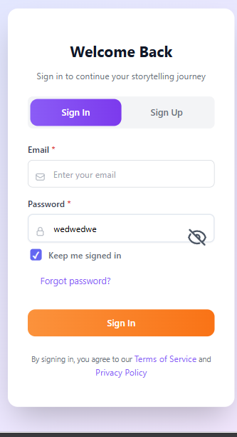

# Keyboard Gray Bar Fix

## Problem
A gray/dark bar was appearing between the main content and the keyboard when the keyboard was opened on Android devices. This created an unsightly gap in the UI.



## Root Cause
The issue was caused by three factors:

1. **Body Background Color Mismatch**: The body had `background-color: #0f172a` (slate-900) which didn't match the app's primary dark theme color `#1a1625`
2. **Keyboard Resize Mode**: Using `resize: 'body'` caused the entire body to resize, revealing the background
3. **Android Window Configuration**: The manifest wasn't properly configured to prevent system window insets from creating gaps

## Solution

### 1. Fixed Body Background Color (`frontend/src/index.css`)

**Before:**
```css
body {
  background-color: #0f172a; /* Slate-900 */
}
```

**After:**
```css
body {
  background-color: #1a1625; /* Matches app theme */
}
```

### 2. Changed Keyboard Resize Mode (`capacitor.config.ts`)

**Before:**
```typescript
Keyboard: {
  resize: 'body',
  style: 'dark',
  resizeOnFullScreen: true
}
```

**After:**
```typescript
Keyboard: {
  resize: 'ionic', // Better handling for hybrid apps
  style: 'dark',
  resizeOnFullScreen: true
}
```

**Why `ionic` mode?**
- `body` mode resizes the entire body element, which can reveal background gaps
- `ionic` mode is specifically designed for Capacitor/Ionic apps
- It resizes the viewport intelligently without exposing background areas

### 3. Android Manifest Configuration (`android/app/src/main/AndroidManifest.xml`)

**Added:**
```xml
android:fitsSystemWindows="false"
```

This prevents Android from automatically adjusting window insets which can create gaps.

## How It Works Now

1. **Unified Background**: The body background now matches the app's dark theme (`#1a1625`)
2. **Smart Resize**: The `ionic` resize mode adjusts the viewport without exposing the body background
3. **No System Gaps**: `fitsSystemWindows="false"` prevents Android from creating automatic padding

### Visual Result

**Before:**
```
┌─────────────────────┐
│   App Content       │
├─────────────────────┤
│   GRAY BAR ❌      │ ← Unwanted gap
├─────────────────────┤
│   Keyboard          │
└─────────────────────┘
```

**After:**
```
┌─────────────────────┐
│   App Content       │
├─────────────────────┤ ← Seamless transition ✅
│   Keyboard          │
└─────────────────────┘
```

## Testing Checklist
- [ ] Build APK with new configuration
- [ ] Test keyboard opening on search input
- [ ] Test keyboard opening on text input fields
- [ ] Verify no gray bar appears
- [ ] Test with different keyboard types (regular, emoji, etc.)
- [ ] Test in both light and dark mode
- [ ] Test on devices with gesture navigation
- [ ] Test on devices with 3-button navigation

## Files Modified
1. `frontend/src/index.css` - Changed body background color
2. `capacitor.config.ts` - Changed keyboard resize mode from `body` to `ionic`
3. `android/app/src/main/AndroidManifest.xml` - Added `fitsSystemWindows="false"`

## Additional Notes
- The `ionic` resize mode is specifically designed for Capacitor apps
- This fix works in conjunction with the safe area fix for the bottom navigation
- The background color `#1a1625` matches the app's primary dark theme used throughout
- No changes needed for iOS as it handles keyboard differently

## Related Fixes
- See `SAFE_AREA_BOTTOM_NAV_FIX.md` for the bottom navigation safe area implementation
- Both fixes work together to provide a seamless edge-to-edge experience
